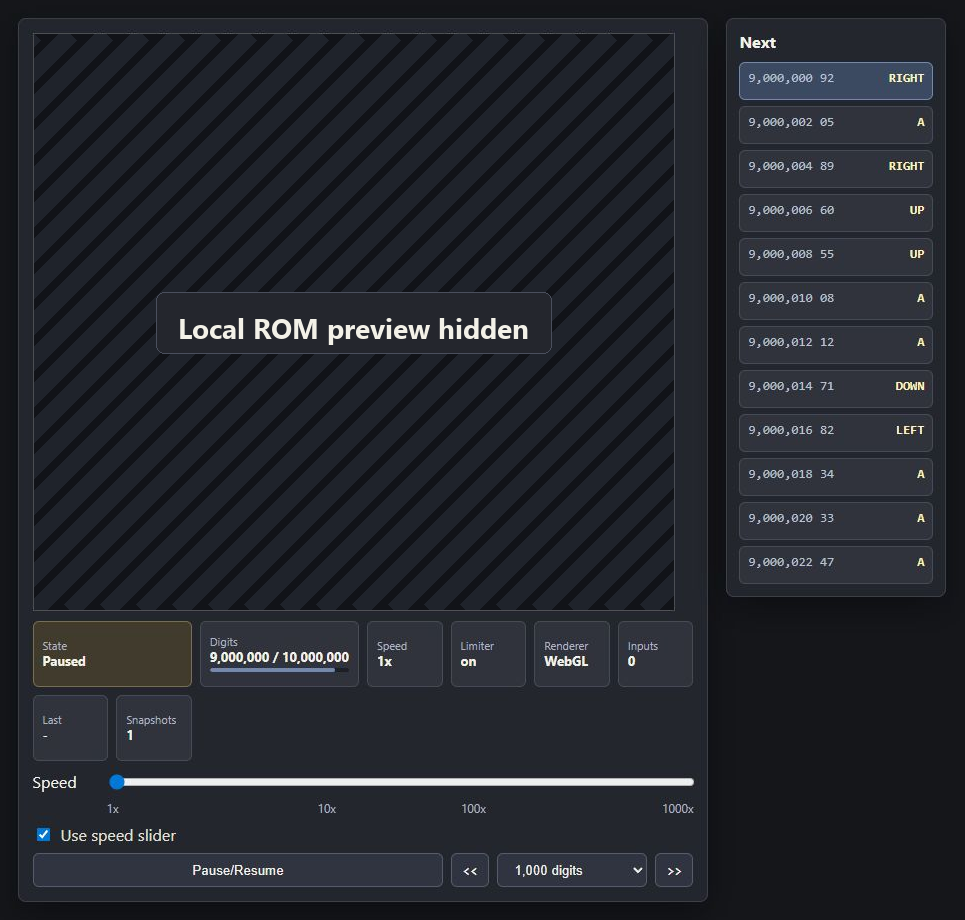

# Pi Plays Pokemon

Experiments for mapping digits of pi to Game Boy inputs and testing whether the resulting input stream can progress through Pokemon Red.

## What This Is

`Pi Plays Pokemon` is a local research toy for deterministic Pokemon Red input experiments. It maps digits of pi into Game Boy button presses, runs the game through PyBoy, saves periodic checkpoints, and provides a browser-based review UI for replaying, inspecting, and extending runs.

The project is designed so the public repository contains only source code and documentation. You bring your own legally obtained ROM and local data files.

**Highest digit reached:** 196,000,000 digits consumed in the `statistical_spread` run.



The README screenshot masks the gameplay preview so the public repo does not include ROM-derived imagery.

## Layout

- `roms/` - local ROM files, ignored by git
- `saves/` - emulator RAM/save state files, ignored by git
- `data/` - downloaded pi digit files, ignored by git
- `tas/` - downloaded TAS/movie files, ignored by git
- `tools/` - downloaded emulator cores and local tools, ignored by git
- `src/` - project code
- `scripts/` - local benchmark and utility scripts
- `results/` - generated benchmark/output files, ignored by git

## Publishing / Asset Policy

This repository intentionally does not include Pokemon ROMs, save files, savestates, screenshots, downloaded TAS movies, pi digit dumps, emulator core binaries, or other generated/local assets.

To run the experiments, provide your own legally obtained Pokemon Red ROM in `roms/` and download or generate pi digit files into `data/`. Those folders are kept in the repo only with `.gitkeep` placeholders.

Before publishing or pushing changes, check:

```powershell
git status --short --ignored
git ls-files
```

Only source code, documentation, and placeholder files should appear in `git ls-files`.

## Setup

```powershell
py -m pip install -r requirements.txt
```

Expected local files:

- `roms/Pokemon - Red Version (USA, Europe) (SGB Enhanced).gb`
- `data/pi_1b_digits.txt` for the current 50M run, or another plain-text pi digit file

The scripts assume default paths, but most commands accept `--rom` and `--digits` overrides. If the web reviewer starts without a ROM at the configured path, the Game Boy screen area becomes a same-size `Load ROM` panel. Selecting a ROM copies it into the configured `roms/` path and initializes the emulator locally. ROM files remain ignored by git.

## Current Benchmark Baseline

On this machine, PyBoy in headless unlimited mode measured roughly:

- single stream with one digit mapped to one button per frame: about 33,000 frames/sec, or about 550x real time
- 16 parallel streams: about 295,000 aggregate frames/sec, or about 4,900x real time

Native emulator cores such as Gambatte should be benchmarked next for a higher ceiling.

## Pi Input Run

The active input scheme consumes two decimal digits at a time and presses the mapped button for two frames, followed by one blank frame:

- `00-53` -> A
- `54-63` -> Up
- `64-73` -> Down
- `74-83` -> Left
- `84-93` -> Right
- `94-98` -> B
- `99` -> Start

The input timing and mapping live in `config/statistical_spread.json`:

- `name` is the friendly label shown in the config dropdown.
- `game` records the target game title, version, and region. The current config targets `Pokemon Red` version `1.0`, region `USA/Europe`.
- `on_frames` controls how many frames the selected button is held.
- `off_frames` controls how many blank frames follow the button press.
- `digits_per_input` controls how many pi digits are consumed for each input.
- `mapping` assigns each decimal range to a Game Boy button.

Run or resume a headless PyBoy test with:

```powershell
py scripts\run_pi_pyboy.py --config config\statistical_spread.json --digits data\pi_10m_digits.txt --checkpoint-digits 1000000
```

For the current 50M run:

```powershell
py scripts\run_pi_pyboy.py --config config\statistical_spread.json --digits data\pi_1b_digits.txt --checkpoint-digits 1000000 --max-digits 50000000
```

Add `--fresh` to ignore existing checkpoints and restart from reset. Pass `--hold-frames` or `--release-frames` only when intentionally overriding the config for an experiment.

Generated savestates go under `saves/<run-name>/`, screenshots under `results/<run-name>/screenshots/`, and progress metadata under `results/<run-name>/progress.json`. These generated files are intentionally ignored by git.

Review a checkpoint in the local web UI:

```powershell
.\scripts\open_review.ps1
```

Open the current Statistical Spread run explicitly:

```powershell
.\scripts\open_review.ps1 -RunName statistical_spread -Config config\statistical_spread.json -Digits data\pi_1b_digits.txt
```

The launcher closes older web or Tk reviewer instances before opening a new browser tab. By default, it opens the penultimate checkpoint so there is room to play forward into the newest available checkpoint.

By default, the reviewer is limited only by the local pi digit file. Pass `-MaxDigits 1000000` to the PowerShell launcher, or `--max-digits 1000000` to `review_web.py`, when you want to cap playback for a shorter review.
The reviewer opens at `10x` by default. The speed slider ranges from `0.1x` through `1000x` to `Unlimited`, and the UI reports both requested speed and measured playback speed. Audio is controlled by a simple mute/unmute button beside Play; audio output is muted while long seeks or simulations are buffering.
The reviewer opens paused by default. Press `Pause/Resume` to start playback, or pass `--start-running` when launching directly. During playback, pausing is applied at the next input boundary: after the current held/released input cycle finishes and before the next pi-derived button is sent. It applies its own frame limiter, so `1x` targets normal Game Boy speed even though the emulator loop is driven manually.

Open a specific checkpoint by digit count:

```powershell
py scripts\review_web.py --checkpoint 5000000 --speed 1 --open-browser
```

The web reviewer continues the same pi input stream from the checkpoint. It serves the Game Boy screen and controls from a local web app with:

- WebGL canvas rendering with Canvas 2D fallback.
- A speed slider from `0.1x` through `1000x` to `Unlimited`, with a mute/unmute audio toggle.
- Digit-based rewind and fast-forward controls folded into the jump panel.
- Arbitrary jump-to-digit support, using the nearest checkpoint first and simulating the remaining gap.
- A checkpoint list, clickable timeline, and current charted-checkpoint progress fill.
- An input preview showing the last three inputs, current input, and upcoming inputs.
- Live location display, including building context such as `Pallet Town | Oak's Lab`.
- Live party panel with expandable moves and PP.
- Player panel with money, Pokedex seen/caught, actual elapsed emulator time with days, bag contents, and gym badges.
- Config panel showing game version/region, digits per input, button ranges, and a button-spread chart.
- Event Finder for warping to the next battle, wild battle, trainer battle, location change, item pickup, level up, evolution, or blackout, with a digit-limit dropdown to prevent long searches.

The Headless simulator panel can extend a run from the browser. Enter an absolute `Simulate up to` digit target and choose `Checkpoint every` to control how frequently savestates/screenshots are written. The simulator resumes from the highest usable checkpoint at or before the target, so extending a run does not replay already-saved work. The resume path has been checked by comparing a full 49M -> 50M advance against loading the 50M checkpoint; the final PyBoy savestates matched byte-for-byte.

## TAS Button Tally

The TAS helper parses BizHawk `.bk2` movie files and counts button press frequency:

```powershell
py scripts\tally_tas_buttons.py path\to\movie.bk2
```

Downloaded TAS files and generated tally outputs are ignored by git.

## Status

This is experimental tooling, not a packaged emulator frontend. The current practical path is PyBoy for simulation and review; native libretro benchmark code is kept under `src/LibretroBench/` for comparison work.
